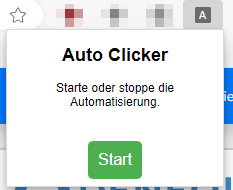

# Denequa-WBT-Auto-Clicker
Die Chrome/Edge Extension allows you to skip the wait time between a possible button click on each page of a Web based training of DENEQUA by eStar GmbH

# Install
1. Download and extract the folder auto-clicker
2. Open chrome://extensions/ or edge://extensions/
3. Enable Developer Mode

4. Press "Load unpacked" and choose the extracted folder auto-clicker

# How to use
1. Open a web based training unit
2. Press Start on the Popup-Window of the extension\

3. The auto clicker should get to work